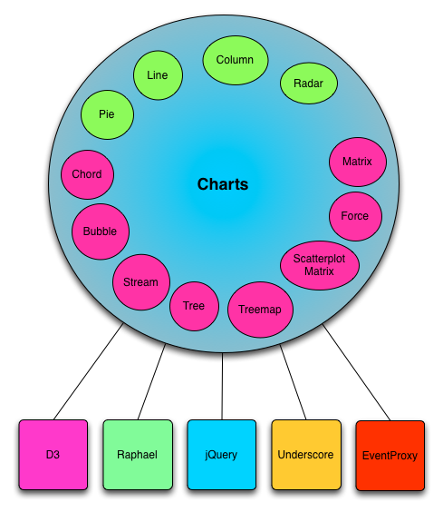
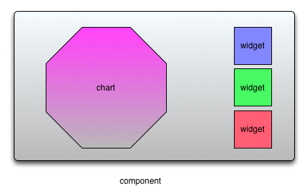
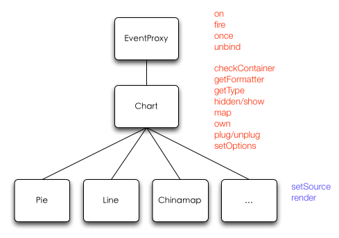

DataV组件库的设计
================
本文简单介绍DataV的设计理念，这样您会明白DataV的来龙去脉，有助于您理解和使用DataV的组件，同时也期望在理解的基础上能够迈进DataV的贡献者队伍中。

## 依赖结构
目前组件库中有8个高级组件，4个基础组件。在底层，我们主要依赖了4个库，每一个库的选择，都是思虑良久才决定的。


### 依赖描述
#### Raphael  

选择Raphael的出发点很简单。它内部分别采用了VML和SVG两套引擎实现跨浏览器的支持。如果没有一个基本图形图像库的支持，DataV需要重头开始实现一些细节，这对于我们团队而言，在时间和精力上都是投入不起的。之所以不选择Canvas技术，有以下几个考虑点：

1. 跨浏览器的支持不够。
2. SVG与VML这样的结构在DOM上能够携带状态，这比纯代码控制图标的状态好让人轻松。
3. 动画。SVG与VML在局部动画的支持上，要远远好于Canvas，它无需整个界面重绘。

在当时的选型中，Processing.js因为选用的Canvas作为基础，在兼容性的选项上落败。
#### D3
在最初我们的理想状态下，只要一个底层绘图库支撑，我们就可以完成可视化组件的开发。后来实践过程才知道，在绘图过程中需要处理大量算法，这一点Raphael无法满足我们的需求，导致我们的代码中会出现大量代码用于布局位置计算。而这一点上D3的数据驱动文档设计上，自身携带了这方面的功能。最初摒弃D3不用的原因在于它自身不提供绘图，以及在浏览器兼容方面，它只照顾了高端浏览器。  
事实面前，灵光却开始闪现。Raphael擅长绘制，D3擅长处理绘制逻辑，用户的数据则是传统意义上的Model。所以前端可视化的简单分层出现，D3司Controller部分，Raphael司View部分，用户则是Model的提供者。这就是选择D3的缘故，它打破我们过去非此即彼的固态思维，使得两个库之间相互协作，各自发挥长处，组件库的开发过程中，可以节省大量基础性的工作。我们将重心可以专注到如何提升组件的易用性上。
#### jQuery
除了SVG与VML这样的DOM操作外，实际绘制过程中，还是需要或多或少接触到DOM相关的操作。尽管用原生JavaScript操作DOM并不难，但是为了调用方便和代码重构，开发过程中，我们会不由自主归类DOM操作函数，到一定程度就会重构出一个DOM操作库来。反之，如果直接使用jQuery这样成熟的DOM库，可以节省掉重构DOM操作的精力。而且大多数Web应用中，不用jQuery的应该寥寥无几了吧。
#### Underscore
或者是对D3的了解还不够，在用户数据的处理上，操作起来并没那么方便。Underscore作为目前除jQuery外最火的库，在操作数据方面的能力十分强大。在预处理数据方面，Underscore能够带来很多帮助。在其函数式调用的风格影响下，可以节省许多代码。
#### EventProxy
为何会加入EventProxy库。EventProxy库的设计是受Backbone的Events部分影响而来。可视化组件编程，终归是GUI编程，事件驱动的场景必不可少。尽管jQuery也有自定义事件，但是纠缠于单个DOM节点，并非组件整体，它在帮助实现组件之间的解耦方面，需要封装后才能生效。作为去掉注释200行左右的小库，引入它，并不带来什么压力。  
在DOM事件方面，依旧交给jQuery去发挥优势，组件层面，则利用EventProxy实现。关于自定义事件的利用，在后续接口设计部分会再次提到。

## 组件结构
最初我们只是要设计可视化组件，其实是我们认为的Chart，既图表。后来随着一些交互和业务的渗入。组件自身开始变得复杂，代码量也开始膨胀，更糟糕的是变更和迭代开始变得十分困难，组件的定制性开始变强，重用性则降低。几经重构和摸索，梳理出来以下三个结构。

### Chart
这是我们最初认为的组件。但是后来发现，它只是组件的一部分，且是核心的一部分。  
过去我们将可视化组件的所有部分都放在一个组件文件内进行开发，我们料想，只要接口友好，内部变动是没有关系的。但是需求变化时，总无法进行轻量的改动。后来进行反思，将一切修饰性的功能都交由外部实现。

### Widget
Widget的中文通常翻译为挂件。在DataV的抽象结构中，它是附属于图表的功能性组件。它也许可重用，也许不能。它与主Chart的交互完全通过事件的方式完成，他们共享配置和输入数据，但是展示逻辑各自实现。

### Component
Component是真正的组件，它是Chart和Widget的总和。Component可以随意组合Widget和Chart。可以保证Chart和Widget自身的稳定性和可重用性。Component可以随着业务的需求变动而变动。



## API设计
所有的组件都是在前文描述的依赖项上构建而成，但是事实上DataV依然做了一个层次性的封装。



### 继承关系
目前所有的组件都继承自DataV.Chart，DataV.Chart则继承自EventProxy。每一个实例Chart都是一个事件Emitter。

组件对于使用者而言，需要关注的只有如下几个步骤：

```
var pie = new Pie('#box', {width: 100, height: 100});
pie.setSource(source);
pie.render();
```
即初始化，设置数据源，渲染三个步骤。使用者更多的精力会防止在选项的设置和保证数据源的正确性上。对于组件内部的方法并不需要操心。

对于组件的开发者，需要向使用者提供setSource和render方法，这两个方法并非强制性，但是我们保持约定，以保持简单。组件开发者的主要精力一般用在Chart提供的`checkContainer`、`setOptions`等方法的调用上，以及在需要事件的地方，调用EventProxy提供的自定义事件，来解耦逻辑，或暴露事件给外部。

通常在小组件的开发中，都无需对外暴露事件，但是在Component组件级别的开发时，这些是十分需要的。chart与widget尽管都是继承自Chart，但是主次关系还是存在的。事件在这种多个图表做业务解耦效果很好。

### 数据映射
在一些组件中，要么用户提供标准的数据，要么数据自身很简单。略微复杂的数据对于调用者和组件来说，都可能带来麻烦，这需要传说中的数据清洗的步骤。DataV在`setSource`方法的设计上，引入了数据映射。

星期 | 销售金额 | 销售笔数
------------ | ------------- | ------------
1 | 100  | 20
2 | 200  | 30

## 视觉设计

## 对应交互

